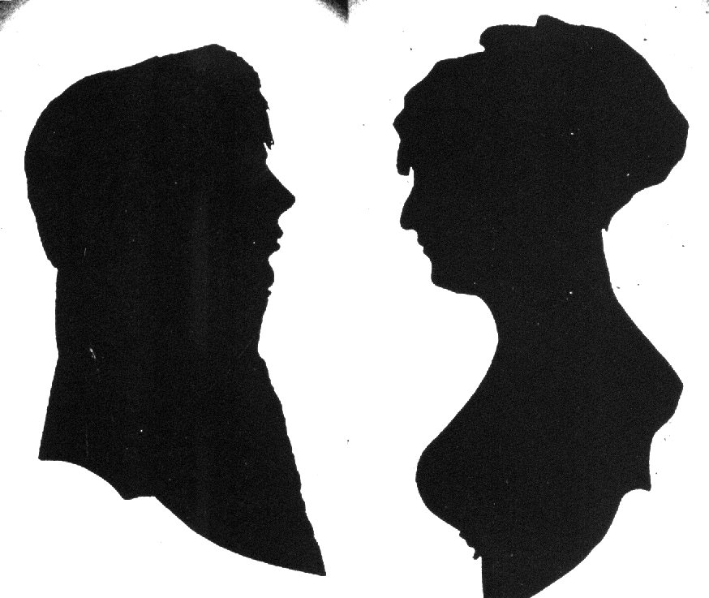
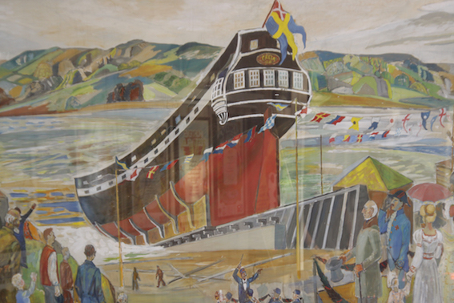

<body background="paper.jpeg">

Takk for stor interesse og nyttige innspill etter vår forespørsel i november ifjor.
Nå er tiden kommet for å ønske dere velkommen til slektstreff for etterkommerne
til Skipsbyggmester Carl Petersen Paaske og hustru Anne, født Nørgaard.

Carl kom fra Danmark i 1807, og i 1815, for 200 år siden, var han med i en
kongelig kommisjon som valgte den indre havnen ved gården Horten til sted
for verft og hovedbase for Marinen. Her var han "Skibsbygmester" fra oppstarten
i 1820 til han døde i sitt hjem på gården Apenes i 1850.

Denne innbydelsen går til etterkommerne etter Anne og Carl. De hadde tre døtre
og tre sønner. Caroline, Elise Margrethe og Charlotte, Johan Henrik, skipsbyggmester
og senere postmester, Peter, jurist og Carl Anthon, bergmester.

| Program | |
|:---------:|--|
| 10.30 | *Oppmøte på Karljohansvern på parkeringsplassen ved Marinemuseet* |
| 11.00-12.00 | *Wenja ønsker velkommen på Cafè Breda på Lokalhistorisk senter (like ved Marinemuseet) Her ser vi Reidar Aulies store maleri av sjøsettingen av Verftets byggenr. 1, fregatten "Freia" med "Skibsbygmesteren" på ærestribunen. Salg av kaffe og vafler. Kort orientering av Endre Pedersen, og eventuelt en liten titt på Lokalhistorisk museum på egen hånd.* |
|12.30 | *Samling på Marinemuseet* |
|13.00-14.45  | *Info og omvisning på Marinemuseet ved Jan Ingar Hansen og flere. Vi deler oss i passende grupper.* |
|15.00-17.00  | *Buffet med varme og kolde retter på Befalsmessa på GAMLEHORTEN GJESTEGÅRD (Kort gangavstand fra Marinemuseet). God anledning til å mingle, gjenoppfriske gamle bekjentskap og treffe nye slektninger.*|

## Gamlehorten Gjestegård

Gå gjerne inn på hjemmesiden til [Gamlehorten Gjestegård](http://www.gamlehortengard.no)
så får dere et godt inntrykk av dette historisk interessante og vakre stedet. Her er det
også gode muligheter for å overnatte, både i enkelt/dobbeltrom eller leiligheter.

Vi har valgt en rikholdig buffet for at alle skal kunne finne mye godt. 
Vertinnen garanterer at all mat er glutenfri.

## Påmelding

Prisen, inklusive guiding på Marinemuseet, er kr 425,- for voksne, kr 210,- for barn
opp til 10 år, og gratis deltakelse for barn under 2 år. Drikke til maten kommer i tillegg.

Bindende påmelding innen **1. mars** til Anne Karin:

Epost: akpaaske@gmail.com

Postadresse: Anne Karin Paaske, Frognerveien 64, 0266 Oslo

Innbetaling innen 1. mars til konto nr 6420.09.01752. Merk innbetalingen *Paasketreff2015*.

**HUSK Å SKRIVE NAVNENE PÅ DE INNBETALINGEN GJELDER**

Ta gjerne kontakt, hvis det er noe dere vil ha mere info om. Videresend gjerne
invitasjonen til andre interesserte familiemedlemmer. Vi kjenner ikke til alle.

_Beste hilsener fra Anne Karin & Nils, Kjerstin & Peter Emil, Eva og Wenja_

_([Les mer om skipet fregatten Freia på Wikipedia)](http://no.wikipedia.org/wiki/%C2%ABFreia%C2%BB_%28fregatt%29_%281828%E2%80%931870%29)_
